<div align="center">

# 🥩 Sear & Stone

### Premium Steakhouse Experience

A modern, responsive and interactive steakhouse website built with **HTML, CSS & JavaScript**.

<p>
  <a href="https://searstone.netlify.app/">
    
  </a>
  <a href="https://github.com/Azeem-Toretto-1/Steak-House">
    
  </a>
</p>

</div>

---

## 🖼️ Preview

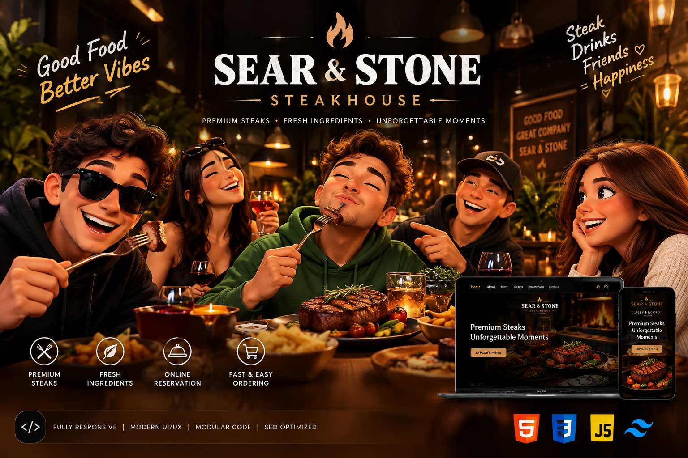

---

## 🍽️ About The Project

**Sear & Stone** is a premium steakhouse website designed to deliver an elegant restaurant experience through a modern and interactive web interface.

The project combines a cinematic dark restaurant aesthetic with smooth animations, interactive food ordering, steak customization, cart functionality, checkout, table reservations and responsive layouts.

The goal was to create a restaurant website that feels like a **real digital dining experience**, rather than a simple static landing page.

---

## ✨ Features

* 🥩 Interactive restaurant menu
* 🍽️ Detailed food item modals
* 🔥 Steak customization
* 🛒 Complete shopping cart system
* ➕ Quantity controls
* 💳 Interactive checkout experience
* 🎉 Order success animation with confetti
* 🔔 Premium add-to-cart toast notifications
* 📅 Functional table reservation form
* 🎊 Reservation success animation
* ⏳ Live event countdown
* ⭐ Interactive testimonials
* 🟢 Dynamic restaurant opening status
* 📱 Fully responsive design
* 🍔 Animated mobile navigation drawer
* 🛍️ Animated cart drawer
* 🔄 Smooth UI interactions
* ✨ Loading screen
* 📈 Scroll progress indicator
* ⬆️ Scroll-to-top functionality
* 🔎 SEO optimized
* 🧩 Modular CSS architecture
* ⚡ Modular JavaScript architecture
* 🎨 Premium restaurant UI/UX

---

## 🛠️ Technologies Used

| Technology   | Purpose                           |
| ------------ | --------------------------------- |
| HTML5        | Semantic website structure        |
| CSS3         | Styling, layouts & animations     |
| JavaScript   | Interactivity & application logic |
| Remix Icons  | Interface icons                   |
| Google Fonts | Typography                        |
| Netlify      | Deployment                        |

---

## 📸 Screenshots

### 🏠 Home

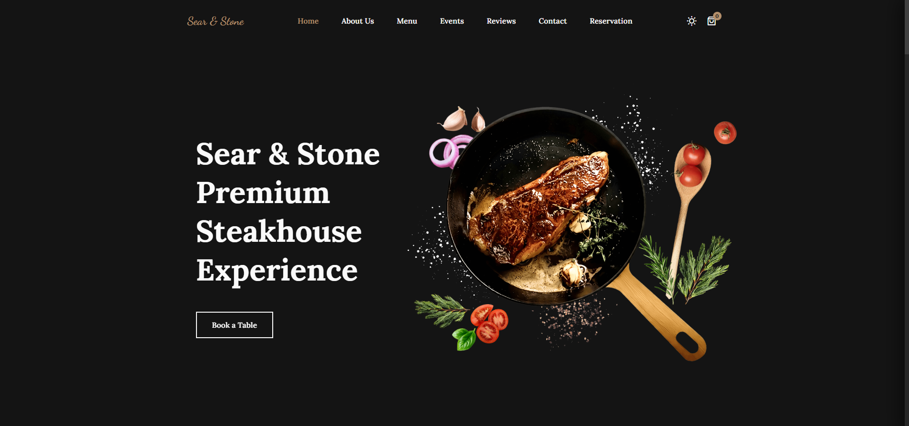

### 📖 About

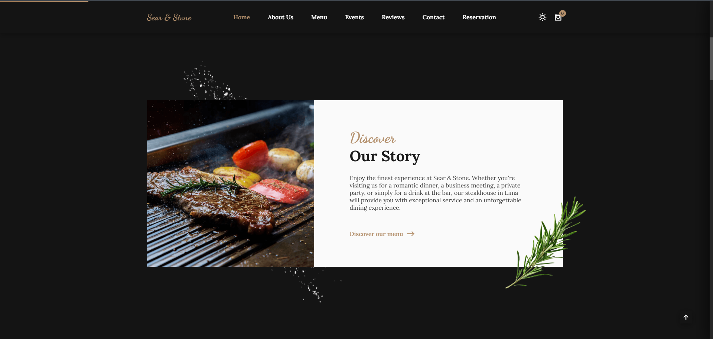

### 🍽️ Menu

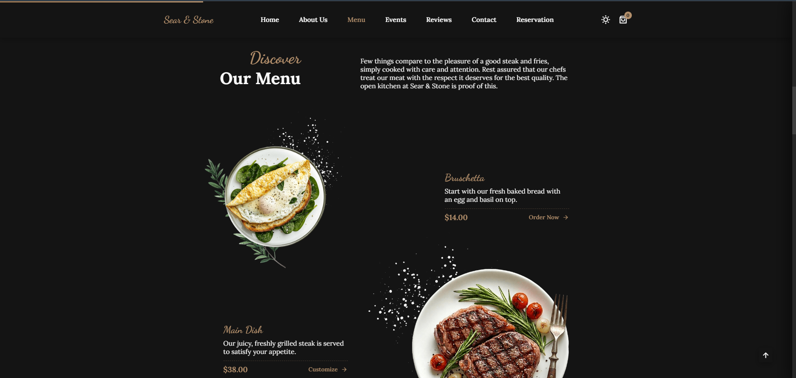

### 🥩 Menu Customization

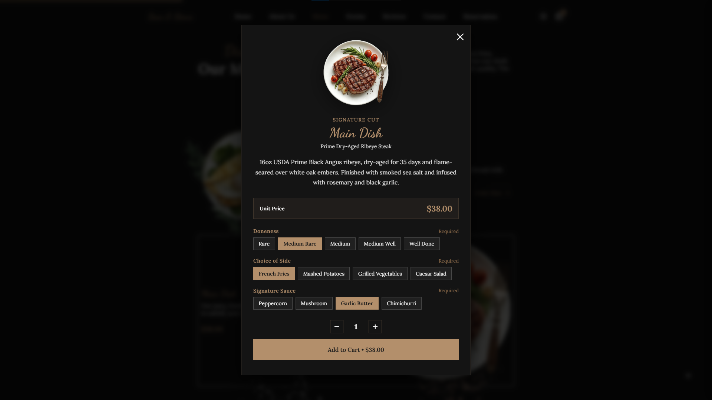

### 🛒 Cart

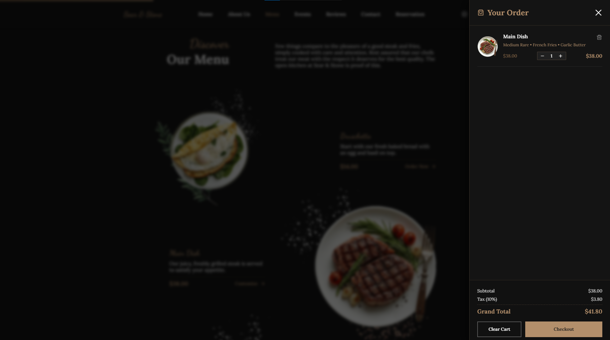

### 💳 Checkout

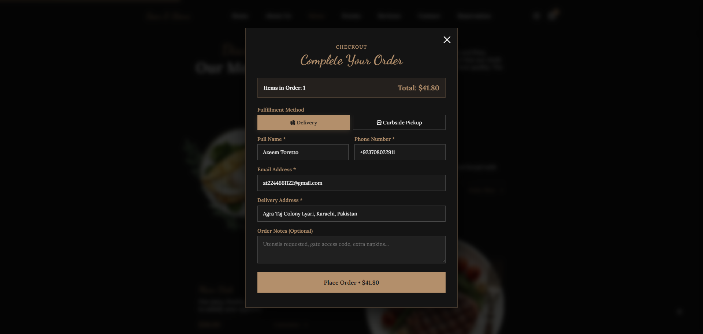

### 📅 Reservation

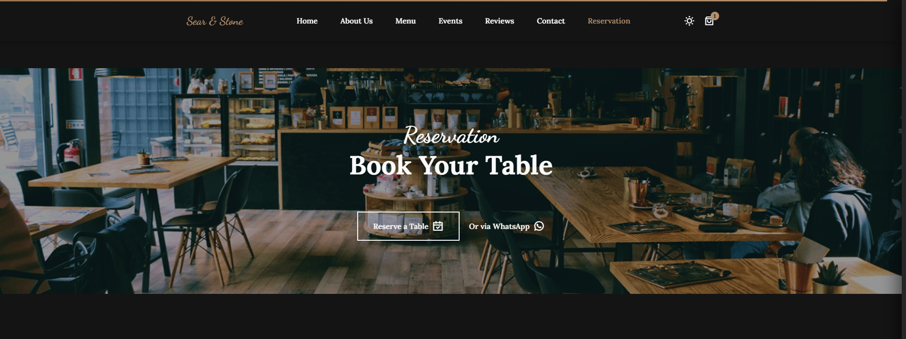

### 🎉 Events

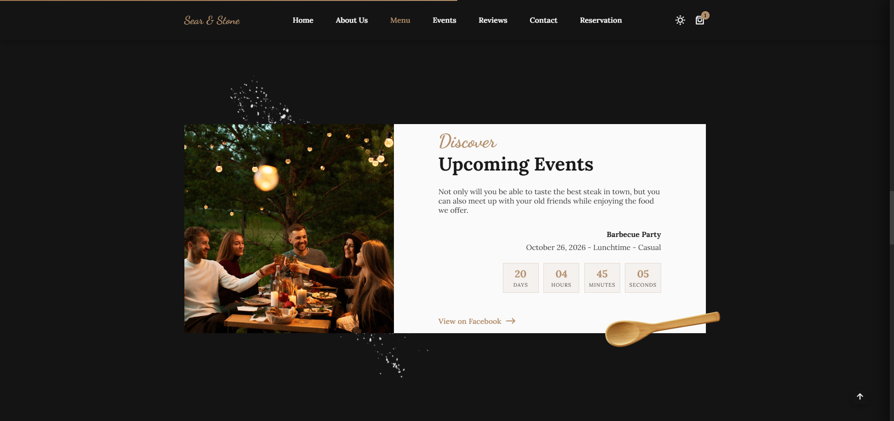

### ⭐ Testimonials

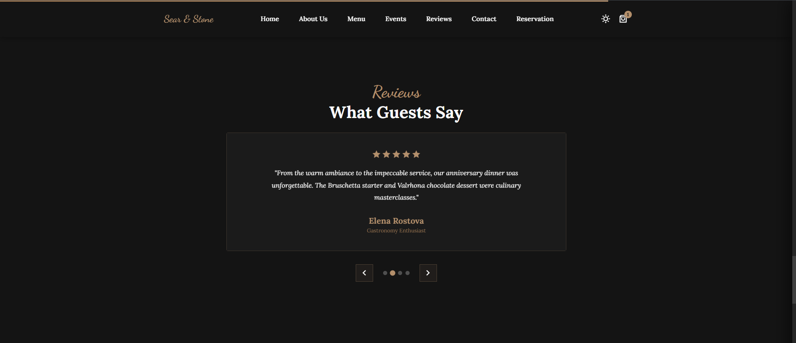

### 📍 Contact

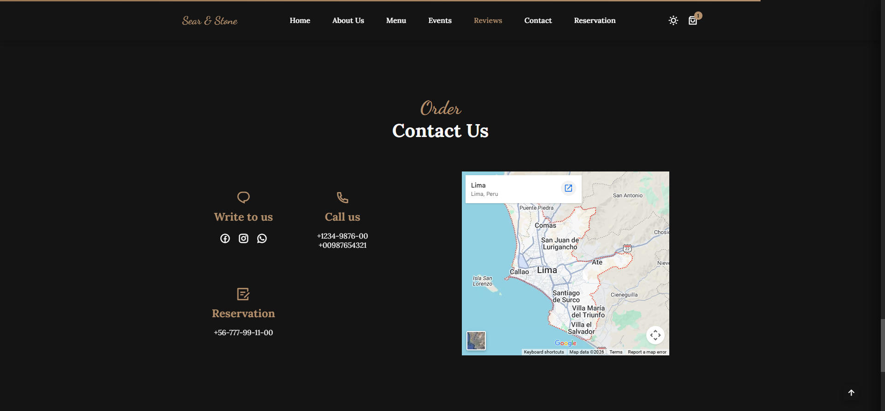

---

## 📱 Responsive Design

Sear & Stone is designed to provide a consistent experience across:

* 🖥️ Desktop
* 💻 Laptop
* 📱 Mobile
* 📟 Tablet

The interface adapts smoothly to different screen sizes while preserving the overall visual experience and usability.

---

## 🗂️ Project Structure

```text
Steak-House/
│
├── assets/
│   ├── css/
│   │   ├── base.css
│   │   ├── layout.css
│   │   ├── components.css
│   │   ├── menu.css
│   │   ├── cart.css
│   │   ├── reservation.css
│   │   ├── animations.css
│   │   └── responsive.css
│   │
│   ├── js/
│   │   ├── main.js
│   │   ├── navigation.js
│   │   ├── loader.js
│   │   ├── menu.js
│   │   ├── customization.js
│   │   ├── cart.js
│   │   ├── checkout.js
│   │   ├── reservation.js
│   │   ├── events.js
│   │   ├── testimonials.js
│   │   └── ui.js
│   │
│   └── img/
│
├── Screenshots/
│   ├── 01-home.png
│   ├── 02-about.png
│   ├── 03-menu.png
│   ├── 04-menu-customization.png
│   ├── 05-cart.png
│   ├── 06-checkout.png
│   ├── 07-reservation.png
│   ├── 08-events.png
│   ├── 09-testimonials.png
│   └── 10-contact.png
│
├── index.html
└── README.md
```

---

## 🚀 Getting Started

### 1. Clone the repository

```bash
git clone https://github.com/Azeem-Toretto-1/Steak-House.git
```

### 2. Navigate to the project

```bash
cd Steak-House
```

### 3. Run the project

Open `index.html` directly in your browser or use **Live Server** in VS Code.

---

## 🌐 Live Demo

Experience the complete Sear & Stone website:

**https://searstone.netlify.app/**

---

## 📂 Repository

View the complete source code on GitHub:

**https://github.com/Azeem-Toretto-1/Steak-House**

---

## 🎯 Project Goals

This project was created to demonstrate:

* Modern frontend development
* Responsive web design
* Interactive JavaScript functionality
* Component-oriented code organization
* Restaurant-focused UI/UX
* E-commerce-style cart functionality
* Form handling
* User interaction design
* SEO implementation
* Clean and maintainable frontend architecture

---

## 👨‍💻 Author

### Azeem Toretto

Frontend Web Developer passionate about building modern, responsive and interactive web experiences.

### Connect With Me

<p>
  <a href="https://github.com/Azeem-Toretto-1">
    
  </a>
  <a href="https://www.linkedin.com/in/azeem-toretto">
    
  </a>
  <a href="https://www.instagram.com/azeem_dev">
    
  </a>
  <a href="https://www.youtube.com/@Azeem-Dev-51">
    
  </a>
</p>

---

## ⭐ Support

If you like this project, consider giving it a ⭐ on GitHub.

---

<div align="center">

### 🥩 Sear & Stone

**Premium Steaks • Fresh Ingredients • Unforgettable Moments**

Made with ❤️ by **Azeem Toretto**

</div>
